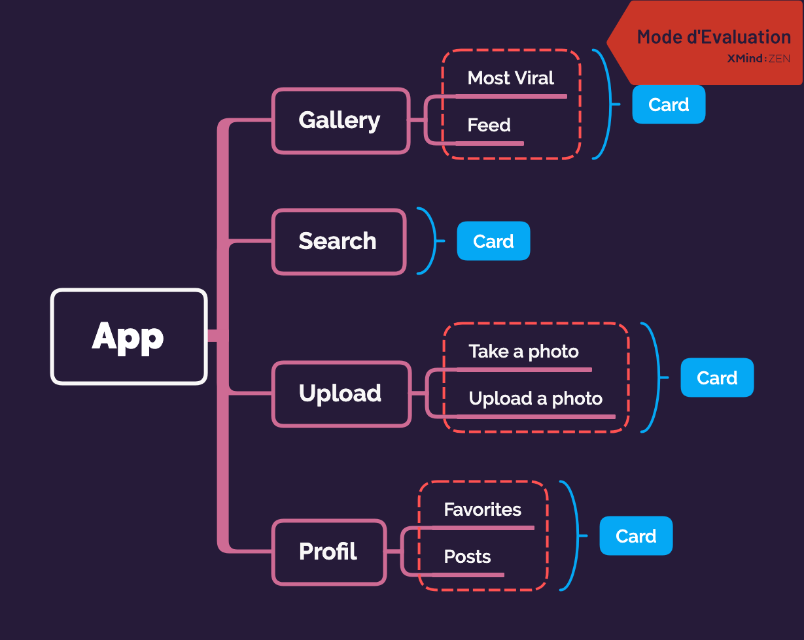

# B-DEV-501-NCY-5-1-epicture-benjamin.kuhnel

# Epicture Project
Epitech Third Year Project

## Subject
The goal of this project is to use and implement online photo sharing API platforms.
Create a photo finder and browsing application the following platform: Imgur.

## Development environments
React Native

# Structure



# Installation
```
yarn
yarn start
yarn android
yarn ios
```

## Login

You need a imgur account to login.

## ToolBar

* Gallery Component
* Search Component
* Upload Component
* Profil Component
